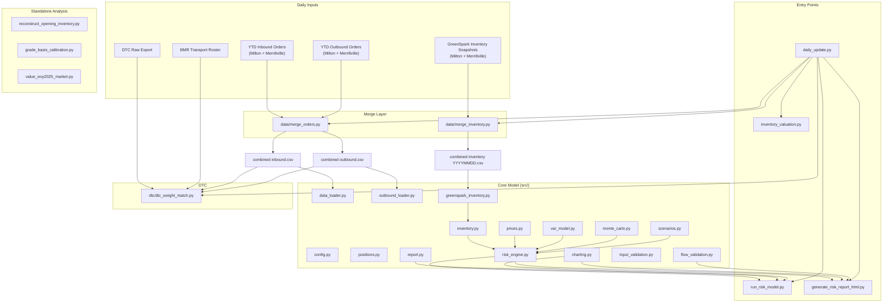
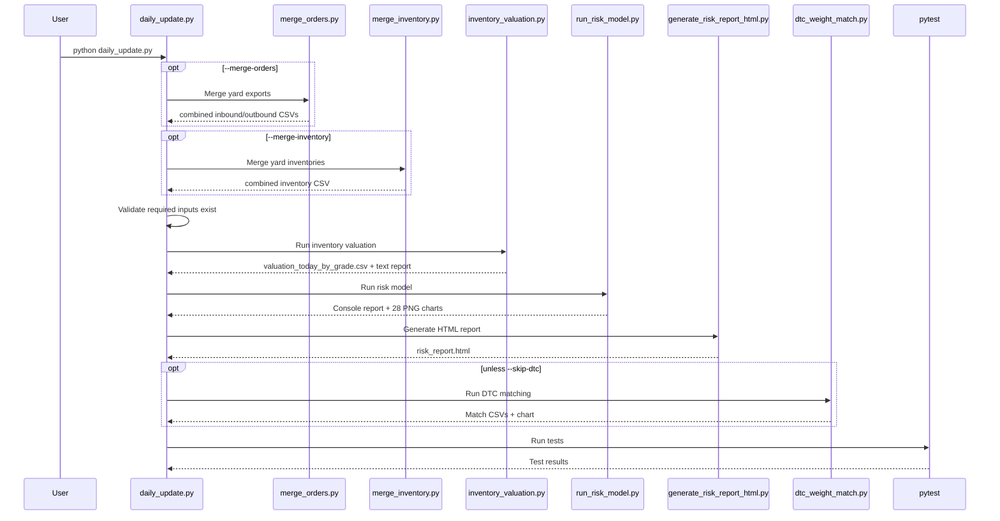
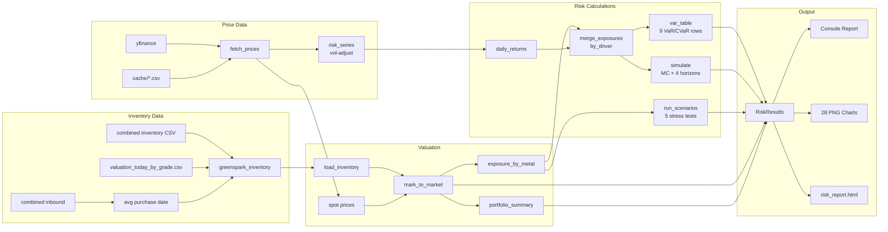

# Scrapyard Risk Model — Complete Repository Deep Dive

> **Scope**: Every file in the repository, what it does, how they all connect, the full data flow, and dead code analysis.
> **Generated**: 2026-06-18

---

## Table of Contents

1. [High-Level Architecture](#high-level-architecture)
2. [Directory Map](#directory-map)
3. [Entry Points & Orchestration](#entry-points--orchestration)
4. [Core Library (`src/`)](#core-library-src)
5. [Standalone Analysis Scripts (root)](#standalone-analysis-scripts-root)
6. [Data Merge Utilities (`data/`)](#data-merge-utilities-data)
7. [DTC Ticket Matching (`dtc/`)](#dtc-ticket-matching-dtc)
8. [Data Files & Directories](#data-files--directories)
9. [Tests (`tests/`)](#tests-tests)
10. [Vault Documentation (`vault/`)](#vault-documentation-vault)
11. [Configuration & Infrastructure](#configuration--infrastructure)
12. [Complete Data Flow Diagrams](#complete-data-flow-diagrams)
13. [Dead Code & Redundancy Analysis](#dead-code--redundancy-analysis)
14. [File-by-File Reference](#file-by-file-reference)

---

## High-Level Architecture

This is a **Python-based market risk model** for a two-yard metal scrapyard operation (Milton/Benton Metals and Merrillville Metal Recycling, collectively "BMR/MMR"). It performs four major functions:

1. **Inventory Valuation** — Loads on-hand physical inventory from GreenSpark ERP snapshots, marks it to market using real transacted scrap prices and commodity futures benchmarks, and computes unrealized P&L at gross, net-realizable, and liquidation levels.

2. **Market Risk Analysis** — Runs VaR (Parametric, EWMA, Historical), Monte Carlo simulation (10,000 correlated GBM paths), and deterministic stress scenarios (2008 crash, China slowdown, rate shock, demand collapse, supercycle rally) across a 30/60/90/180-day horizon.

3. **DTC (Direct-to-Consumer) Order Reconciliation** — Matches DTC pass-through orders to their inbound and outbound GreenSpark tickets by net weight, validates them against a BMR Transport roster, and flags exceptions.

4. **EOY-2025 Portfolio Reconstruction** — Works backward from current inventory + YTD flows to reconstruct the opening inventory, then values it at end-of-2025 market prices using Jan-2026 scrap sale prices rolled back via yfinance futures.



---

## Directory Map

```
Scrap/
├── .gitignore                          # Git ignore rules
├── README.md                           # Main project docs & workflow guide
├── requirements.txt                    # Python dependencies
├── daily_update.py                     # MASTER ORCHESTRATOR — runs the full daily pipeline
├── run_risk_model.py                   # Entry point for CLI risk model
├── generate_risk_report_html.py        # Entry point for HTML report generation
├── inventory_valuation.py              # Cost vs market valuation (EOY-2025 + today)
├── reconstruct_opening_inventory.py    # Backward reconstruction of EOY-2025 inventory
├── grade_basis_calibration.py          # Calibrate per-grade scrap/futures basis from real trades
├── value_eoy2025_market.py             # Value EOY-2025 portfolio at Dec-31-2025 market prices
├── risk_report.html                    # Generated HTML report output (tracked)
├── risk_report_standalone.html         # Self-contained HTML with embedded images (~14MB)
│
├── src/                                # Core model library
│   ├── __init__.py                     # Package marker
│   ├── config.py                       # ALL configuration: paths, metals, grades, risk params
│   ├── data_loader.py                  # Load & normalize INBOUND (purchase) tickets
│   ├── outbound_loader.py             # Load & normalize OUTBOUND (sales) tickets
│   ├── greenspark_inventory.py        # Load on-hand inventory from GreenSpark snapshot
│   ├── input_validation.py            # Column checks, negative checks, snapshot validation
│   ├── flow_validation.py             # Compare GreenSpark snapshot to YTD flow netting
│   ├── positions.py                    # FIFO netting engine: inbound - outbound = on-hand
│   ├── inventory.py                    # Mark-to-market, portfolio summary, exposure calc
│   ├── prices.py                       # Fetch/cache/synthetic price data via yfinance
│   ├── var_model.py                    # VaR & CVaR (parametric, EWMA, historical)
│   ├── monte_carlo.py                  # Correlated GBM Monte Carlo simulation
│   ├── scenarios.py                    # Deterministic stress scenarios & basis stress
│   ├── risk_engine.py                  # Assembles everything into RiskResults dataclass
│   ├── report.py                       # Console output + ALL chart rendering (matplotlib)
│   └── charting.py                     # Orchestrates chart rendering for a RiskResults
│
├── data/                               # Historical/static data + merge scripts
│   ├── merge_orders.py                 # Merges yard inbound/outbound into combined CSVs
│   ├── merge_inventory.py              # Merges yard inventory reports into combined CSV
│   ├── 2026 ytd milton inbound.csv     # Milton inbound tickets (YTD, ~810KB)
│   ├── 2026 ytd merriville inbound.csv # Merrillville inbound tickets (~62KB)
│   ├── 2026 ytd milton outbound.csv    # Milton outbound tickets (~196KB)
│   ├── 2026 ytd merriville outbound.csv# Merrillville outbound tickets (~135KB)
│   ├── Milton - Inventory Report...csv # Milton GreenSpark inventory snapshot
│   ├── Merriville - Inventory...csv    # Merrillville GreenSpark inventory snapshot
│   ├── merrilolville inv summary...csv # EOY-2025 Merrillville closing balance
│   └── mitlon inv summary...csv        # EOY-2025 Milton closing balance
│
├── daily_inputs/                       # DAILY UPLOAD FOLDER — replaced each day
│   ├── combined inventory *.csv        # Auto-generated combined inventory snapshot
│   ├── 2026 ytd combined inbound.csv   # Auto-generated combined inbound
│   ├── 2026 ytd combined outbound.csv  # Auto-generated combined outbound
│   ├── Copy of MASTER...DTC_raw_data.csv # DTC raw export from dashboard
│   ├── (yard-level CSVs also present)  # Raw per-yard files for merge
│   └── ...
│
├── cache/                              # Cached commodity price data from yfinance
│   ├── steel_prices.csv
│   ├── copper_prices.csv
│   ├── aluminium_prices.csv
│   └── stainless_prices.csv
│
├── output/                             # Generated model outputs
│   ├── last_risk_run.json              # Run-to-run comparison metadata
│   ├── grade_basis_calibration.csv     # Calibrated per-grade scrap basis
│   ├── grade_basis_calibration.txt     # Human-readable basis calibration report
│   ├── inventory_valuation.txt         # Cost vs market valuation text report
│   ├── valuation_today_by_grade.csv    # Today's per-grade market prices (feeds GreenSpark)
│   ├── valuation_today_by_metal.csv    # Today's per-metal market summary
│   ├── valuation_eoy2025_by_grade.csv  # EOY-2025 per-grade valuation
│   ├── valuation_eoy2025_by_metal.csv  # EOY-2025 per-metal valuation
│   ├── opening_inventory_eoy2025_by_grade.csv
│   ├── opening_inventory_eoy2025_by_metal.csv
│   ├── opening_inventory_reconciliation.txt
│   ├── opening_portfolio_weights_by_grade.csv
│   ├── opening_portfolio_weights_by_metal.csv
│   ├── eoy2025_market_value_by_grade.csv
│   ├── eoy2025_market_value_by_metal.csv
│   ├── eoy2025_market_value.txt
│   └── charts/                         # 28 generated PNG charts
│       ├── commodity_breakdown.png
│       ├── inventory_aging.png
│       ├── price_history.png
│       ├── return_distributions.png
│       ├── monte_carlo.png             # Portfolio-level MC
│       ├── monte_carlo_{metal}.png     # Per-metal MC (7 metals)
│       ├── scenarios.png               # Portfolio stress chart
│       ├── scenarios_{metal}.png       # Per-metal stress (7)
│       ├── var_summary.png             # Portfolio VaR chart
│       └── var_summary_{metal}.png     # Per-metal VaR (7)
│
├── dtc/                                # DTC ticket matching system
│   ├── dtc_weight_match.py             # Main matching pipeline
│   ├── BMR_Transport_Data.csv          # Valid DTC material/supplier roster
│   ├── dtc_weight_matches.csv          # Generated: all matches
│   ├── dtc_match_exceptions.csv        # Generated: flagged exceptions
│   ├── dtc_ticket_match.png            # Generated: color-coded summary chart
│   └── dtc_ticket_match.csv            # Generated: CSV twin of chart
│
├── tests/                              # pytest test suite
│   ├── test_assumptions.py
│   ├── test_flow_loaders.py
│   ├── test_input_validation.py
│   ├── test_inventory.py
│   ├── test_positions.py
│   ├── test_prices.py
│   ├── test_risk_edge_cases.py
│   └── test_risk_engine.py
│
└── vault/                              # Obsidian-style documentation vault
    ├── Home.md
    └── Notes/
        ├── Risk Model Overview.md
        ├── Price Data.md
        ├── Inventory & Grades.md
        ├── VaR and CVaR.md
        ├── Monte Carlo.md
        ├── Stress Scenarios.md
        ├── How to Use This for Business Decisions.md
        └── Risk Model Review Backlog.md
```

---

## Entry Points & Orchestration

### [daily_update.py](file:///c:/Users/thoma/Gavin%27s%20Scrap/Scrap/daily_update.py) — Master Daily Pipeline

**This is the single command you run each day.** It orchestrates the entire workflow as a sequence of subprocess calls:

| Step | What It Runs | Condition |
|------|-------------|-----------|
| 1 | `data/merge_orders.py` | Only if `--merge-orders` flag |
| 2 | `data/merge_inventory.py` | Only if `--merge-inventory` flag |
| 3 | Input validation | Always — checks combined files exist |
| 4 | `inventory_valuation.py` | Always — rebuilds market price outputs |
| 5 | `run_risk_model.py` | Always — runs full risk model + charts |
| 6 | `generate_risk_report_html.py` | Always — rebuilds HTML report |
| 7 | `dtc/dtc_weight_match.py` | Unless `--skip-dtc` |
| 8 | `pytest` | Always — runs full test suite |

**CLI Flags:**
- `--no-refresh-prices` — Use cached market prices (no yfinance download)
- `--skip-dtc` — Skip DTC ticket matching
- `--merge-orders` — Rebuild combined inbound/outbound from yard-level exports first
- `--merge-inventory` — Rebuild combined inventory snapshot from yard-level reports first

**Pre-flight validation** (`_require_inputs`): Checks that the required combined CSVs and DTC export exist in `daily_inputs/` before proceeding. Fails fast with clear error messages.

**Environment**: Sets `MPLCONFIGDIR=/private/tmp` to avoid matplotlib font cache issues on macOS.

---

### [run_risk_model.py](file:///c:/Users/thoma/Gavin%27s%20Scrap/Scrap/run_risk_model.py) — CLI Risk Model

The command-line entry point that:
1. Calls `build_market_risk()` from `risk_engine.py` to compute everything
2. Prints a formatted console report (inventory table, VaR, Monte Carlo, stress scenarios)
3. Renders all charts to `output/charts/` via `render_risk_charts()`

**CLI Flags:**
- `--refresh` — Force re-download of price data from yfinance
- `--no-charts` — Skip chart generation
- `--fail-on-synthetic` — Abort if synthetic price data would be needed

> [!IMPORTANT]
> The actual computation happens entirely inside `build_market_risk()`. This script is just UI and chart orchestration.

---

### [generate_risk_report_html.py](file:///c:/Users/thoma/Gavin%27s%20Scrap/Scrap/generate_risk_report_html.py) — HTML Report Generator

A **682-line** module that generates a polished, self-contained HTML risk report. This is the most complex single file in the repository.

**What it does:**
1. Calls `build_market_risk()` for all risk calculations
2. Calls `render_risk_charts()` to regenerate all PNG charts
3. Calls `build_flow_validation()` and `economic_reconciliation()` for inventory validation
4. Calls `run_basis_stress()` for basis compression stress tests
5. Loads the previous run summary from `output/last_risk_run.json` for run-to-run comparison
6. Assembles everything into a single HTML file with inline CSS

**HTML Report Sections:**
1. **Header** — Portfolio MTM, Unrealized P&L, report date
2. **KPI Cards** (8 cards) — Gross MTM, NRV, 95% VaR, Model Status, Priced Coverage, Unpriced Risk, Concentration, Validation Warnings
3. **Portfolio Overview** — Full MTM table with book/spot/breakeven/basis/NRV/liquidation, commodity breakdown chart, aging chart
4. **Model Quality** — Decision guidance, warnings list, input provenance (SHA-256 hash)
5. **Run Comparison** — Current vs previous run deltas
6. **Inventory Validation** — GreenSpark snapshot vs YTD flow netting, realized margin signal
7. **Valuation Quality** — MTM by confidence tier, unpriced inventory detail
8. **Realization & Basis Risk** — Zero-cost review, basis compression stress, economic P&L signal
9. **Value at Risk** — VaR summary chart + full VaR table
10. **Monte Carlo** — Multi-horizon portfolio paths chart, percentile ladder, horizon comparison table
11. **Stress Scenarios** — Scenario chart + breakdown table
12. **Price History & Returns** — Price charts + return distribution charts
13. **Commodity Deep Dives** — Per-metal MC, VaR, and stress charts (7 metals × 3 charts = 21 charts)
14. **Methodology** — Price sources table, risk calculation descriptions, model assumptions with source/confidence/rationale

**Key helper functions:**
- `usd()` — Format dollar values with optional sign and compact mode
- `cls()` — Return CSS class "pos" or "neg" based on sign
- `confidence_class()` — Map valuation confidence to CSS badge class
- `action_guidance()` — Map model status to plain-English business guidance
- `_run_summary()` / `_load_previous_summary()` / `_summary_rows()` — Run-to-run comparison logic

---

## Core Library (`src/`)

### [src/config.py](file:///c:/Users/thoma/Gavin%27s%20Scrap/Scrap/src/config.py) — Central Configuration

**Everything configurable lives here.** No magic constants anywhere else in the model.

| Category | Contents |
|----------|----------|
| **Paths** | `BASE_DIR`, `DATA_DIR`, `DAILY_INPUT_DIR`, `CACHE_DIR`, `OUTPUT_DIR`, `CHARTS_DIR` |
| **METALS dict** | 7 metals (copper, aluminium, steel, stainless, brass, lead, zinc), each with: ticker/proxy, USD/tonne multiplier, per-grade basis discounts |
| **Grade Basis** | Per-grade scrap-to-futures ratios (e.g., `No.1 Bare Bright` copper = 0.92 of futures) |
| **COMMODITY_TO_METAL** | Maps 13 GreenSpark commodity names → 7 metals (or `None` for OTHER/ZWASTE) |
| **Risk Parameters** | `LOOKBACK_YEARS=5`, `HOLDING_PERIOD_DAYS=30`, `VAR_CONFIDENCE_LEVELS=[0.90, 0.95, 0.99]`, `MONTE_CARLO_SIMULATIONS=10,000`, `EWMA_LAMBDA=0.94`, `SCRAP_BASIS_VOL_MULT=1.25`, `MC_ZERO_DRIFT=True` |
| **Haircuts** | `NET_REALIZABLE_HAIRCUTS` (4–12%) and `LIQUIDATION_HAIRCUTS` (10–30%) per metal |
| **Basis Stress** | `BASIS_STRESS_POINTS = [0.02, 0.05, 0.10]` |
| **Stress Scenarios** | 5 named scenarios with per-metal percentage shocks |
| **ASSUMPTIONS** | Self-documenting dict: each assumption has value, source, confidence, last_reviewed, rationale |

**How metals with no direct futures ticker work:**

Stainless, brass, lead, and zinc have no free exchange ticker. They use `price_proxy: "copper"` — they reuse copper's price series for VaR/MC calculations. Stainless additionally has `vol_multiplier: 1.15` to scale its volatility higher.

---

### [src/prices.py](file:///c:/Users/thoma/Gavin%27s%20Scrap/Scrap/src/prices.py) — Price Data Pipeline

**Responsibilities:**
1. Download commodity futures from Yahoo Finance via `yfinance`
2. Convert to USD per metric tonne
3. Cache to disk with metadata (source, date range, timestamp)
4. Fall back gracefully: live → stale cache → synthetic

**Price resolution cascade (`fetch_prices`):**

```
1. If metal has price_proxy → recursively fetch proxy's price, rename
2. If fresh cache exists (within 1 day) → use cache
3. Try yfinance download → if success, write to cache, return
4. If download fails:
   a. If stale real cache exists → use it (labeled "stale-cache")
   b. Otherwise → generate synthetic GBM series (labeled "synthetic")
      - Written to separate file (metal_synthetic_prices.csv)
      - NEVER overwrites real cache
```

**Volatility adjustment (`risk_series`):**

For VaR and Monte Carlo, returns are amplified by `SCRAP_BASIS_VOL_MULT × metal.vol_multiplier`:
- This accounts for the fact that scrap prices are more volatile than exchange futures
- The level of the resulting series is irrelevant (only returns matter for risk)
- The actual spot price for MTM display still comes from the unscaled series

**Key functions:**
- [fetch_prices](file:///c:/Users/thoma/Gavin%27s%20Scrap/Scrap/src/prices.py#L90-L125) — Core price fetcher with fallback cascade
- [fetch_all_prices](file:///c:/Users/thoma/Gavin%27s%20Scrap/Scrap/src/prices.py#L128-L130) — Fetch for all 7 metals
- [risk_series](file:///c:/Users/thoma/Gavin%27s%20Scrap/Scrap/src/prices.py#L146-L158) — Scale returns by basis-volatility multiplier
- [merge_exposures_by_driver](file:///c:/Users/thoma/Gavin%27s%20Scrap/Scrap/src/prices.py#L191-L205) — Merge proxy metals into their driver for VaR/MC (e.g., brass+lead+zinc exposures all fold into copper's return series)
- [ewma_volatility](file:///c:/Users/thoma/Gavin%27s%20Scrap/Scrap/src/prices.py#L170-L175) — Exponentially-weighted moving average vol (RiskMetrics-style)

**Module-level state:** `LAST_PRICE_SOURCES` is a mutable dict tracking where each metal's price came from during the current session. Cleared by `fetch_all_prices()`.

---

### [src/data_loader.py](file:///c:/Users/thoma/Gavin%27s%20Scrap/Scrap/src/data_loader.py) — Inbound (Purchase) Ticket Loader

Loads YTD inbound purchase ticket CSVs from `daily_inputs/`.

**File discovery (`find_inbound_csvs`):**
- Prefers files matching `*combined*inbound*.csv` (the merged output)
- Falls back to individual yard files (`*inbound*.csv` excluding "combined")

**Normalization (`_read_inbound_one`):**
1. Validates required columns: `Commodity Name`, `Cost`, `Net Weight`, `Effective Date`
2. Maps `Commodity Name` → `metal` via `COMMODITY_TO_METAL`
3. Converts `Net Weight` from lbs → tonnes (÷ 2204.62)
4. Computes `purchase_price_per_tonne = Cost / quantity_tonnes`
5. Parses dates with fallback: ISO8601 → `%m/%d/%y` legacy format
6. Strips trailing bracketed timezone annotations from date strings

**Filters:** Drops rows with `None` metal, zero quantity, zero cost, or unparseable dates.

---

### [src/outbound_loader.py](file:///c:/Users/thoma/Gavin%27s%20Scrap/Scrap/src/outbound_loader.py) — Outbound (Sales) Ticket Loader

Mirror of `data_loader.py` for sales tickets.

**Key difference:** Filters by `DEPLETING_STATUSES = {"PAID", "INVOICED", "SHIPPED"}` — only these statuses count as inventory that has actually left the yard. Other statuses (quotes, pending) are excluded.

**Additional columns:** `revenue` (from `Expected Value`), `cogs` (from `Cost`), `sale_price_per_tonne`, `cogs_per_tonne`, `status`.

---

### [src/greenspark_inventory.py](file:///c:/Users/thoma/Gavin%27s%20Scrap/Scrap/src/greenspark_inventory.py) — GreenSpark Inventory Loader

**This is the authoritative source of physical inventory.** The GreenSpark snapshot tells us what's actually in the yard right now.

**Key behaviors:**

1. **Snapshot discovery** — Finds `combined inventory YYYYMMDD.csv` in `daily_inputs/` (or falls back to `data/`)
2. **Weight/cost loading** — Reads `Total Net Weight` and `Total Cost` per material code, converts lbs → tonnes
3. **Acquisition date estimation** (`_inbound_avg_date_by_code`) — Since the snapshot doesn't contain purchase dates, this function reads the inbound ticket files and computes a weight-average purchase date per material code. Falls back to the snapshot date for codes with no inbound history.
4. **Market price attachment** (`_market_price_per_tonne_by_code`) — Reads `output/valuation_today_by_grade.csv` (produced by `inventory_valuation.py`) to get real $/lb sale prices per material code. Converts to $/tonne.
5. **Commodity filtering** — Rows whose commodity maps to `None` (OTHER, ZWASTE) are separated into a `dropped` DataFrame and excluded from modelling but reported.

**Validation state:** Stores validation warnings and provenance info in module-level lists/dicts (`LAST_SNAPSHOT_VALIDATION_WARNINGS`, `LAST_SNAPSHOT_PROVENANCE`) for the risk engine and HTML report to access.

> [!IMPORTANT]
> There is a **critical dependency**: `inventory_valuation.py` must run BEFORE the risk model so that `valuation_today_by_grade.csv` exists. The `daily_update.py` pipeline enforces this ordering.

---

### [src/input_validation.py](file:///c:/Users/thoma/Gavin%27s%20Scrap/Scrap/src/input_validation.py) — Input Data Validation

**Validation functions:**

| Function | What It Checks |
|----------|---------------|
| `require_columns` | Fatal: required CSV columns must exist |
| `require_nonnegative` | Fatal: weight/cost columns must not be negative |
| `validate_greenspark_snapshot` | Non-fatal warnings for: stale snapshot (>3 business days), duplicate location+material code rows, unmapped commodity names, positive-weight zero-cost rows, extreme weight (>500K lbs), extreme cost (>$10/lb) |
| `file_provenance` | Computes SHA-256 hash, row count, snapshot date from filename |

The warnings from `validate_greenspark_snapshot` flow into the Model Quality section of the HTML report and affect the model status (ok / review / degraded / do_not_use).

---

### [src/positions.py](file:///c:/Users/thoma/Gavin%27s%20Scrap/Scrap/src/positions.py) — FIFO Netting Engine

**Purpose:** Nets inbound against outbound tickets using FIFO (First In, First Out) to derive the current on-hand inventory from ticket data.

> [!NOTE]
> This is the **alternative** inventory source (selected with `source="netting"` in `load_inventory()`). The default and preferred source is the GreenSpark snapshot. FIFO netting is used for validation/reconciliation, not as the primary inventory.

**How `_fifo_remaining` works:**
1. Sort purchase lots by date (oldest first)
2. Consume oldest lots first until sold tonnage is exhausted
3. Partially consumed lots retain their original cost basis
4. Returns: surviving lots + any shortfall (sold more than bought)

**Outputs of `build_positions`:**
- `inventory_df` — Surviving lots after netting
- `recon_grade` — Per-grade reconciliation: bought, sold, on-hand, shortfall
- `recon_metal` — Per-metal rollup of the above
- `margin_df` — Realized gross margin per grade from outbound tickets

---

### [src/inventory.py](file:///c:/Users/thoma/Gavin%27s%20Scrap/Scrap/src/inventory.py) — Mark-to-Market & Valuation

**The heart of inventory valuation.** Takes raw inventory (from either GreenSpark or FIFO netting) and produces a fully marked-to-market DataFrame.

**`load_inventory(source)`:** Dispatcher that calls either `load_greenspark_lots()` (default) or `current_inventory()` (FIFO netting).

**`mark_to_market(df, spot_prices)` — Core valuation logic:**

For each inventory row:
1. Look up the metal's spot price (futures $/tonne)
2. Compute `modelled_scrap = spot × grade_basis` (e.g., `No.1 Bare Bright` = spot × 0.92)
3. Check if a real market price exists (`market_price_per_tonne` from GreenSpark/valuation)

**Pricing policy (two modes):**

| Mode | `allow_futures_fallback=False` (default) | `allow_futures_fallback=True` |
|------|----------------------------------------|-------------------------------|
| Has real price | Use real price → `"A: real sale"` | Use real price → `"A: real sale"` |
| No real price | Hold at book cost → `"Unpriced"`, zero P&L, zero sensitivity | Use `spot × basis` → `"E: futures fallback"` |

**Computed fields per row:**
- `book_value`, `mtm_value`, `unrealised_pnl`
- `net_realizable_value` = MTM × (1 - metal haircut)
- `liquidation_value` = MTM × (1 - liquidation haircut)
- `risk_exposure_value` = For priced rows: NRV. For unpriced: `max(NRV at book, futures-proxy NRV)` — conservative proxy
- `days_held` = calendar days since purchase
- `sensitivity_per_dollar` = `quantity × basis_factor` (tonnes of exposure per $1 spot move)
- `zero_cost_flag` + `zero_cost_policy` — Flags rows with negligible book cost

**`portfolio_summary`:** Aggregates per metal: total tonnes, book, MTM, NRV, liquidation, P&L, spot, avg days held, sensitivity, weighted-average basis, breakeven price.

**`exposure_by_metal`:** Returns dict of `{metal: risk_exposure_value}` for input to VaR/MC/stress.

---

### [src/var_model.py](file:///c:/Users/thoma/Gavin%27s%20Scrap/Scrap/src/var_model.py) — Value at Risk

Three VaR methods, each computing VaR and CVaR (Expected Shortfall):

**1. Parametric VaR** (`parametric_var`):
- Assumes normally-distributed returns
- `VaR = exposure × σ_daily × z × √horizon`
- `CVaR = exposure × σ_daily × φ(z) / (1-α) × √horizon`

**2. EWMA VaR** (`ewma_var`):
- Uses exponentially-weighted volatility (λ=0.94, RiskMetrics convention)
- More responsive to recent market moves than flat historical vol
- Same normal-distribution formulae with EWMA σ

**3. Historical VaR** (`historical_var`):
- Non-parametric: uses actual observed rolling N-day returns
- `VaR = percentile(losses, confidence × 100)` over overlapping windows
- `CVaR = mean of losses ≥ VaR`

**Portfolio VaR** (`portfolio_var`):
- Computes per-metal standalone VaR
- Computes portfolio VaR accounting for correlations (covariance matrix)
- `diversification_benefit = Σ(standalone VaR) - portfolio VaR`
- For parametric/EWMA: uses matrix-form `w'Σw`
- For historical: uses weighted portfolio returns

**`var_table`:** Runs all 3 methods at all 3 confidence levels = 9 rows of VaR/CVaR.

---

### [src/monte_carlo.py](file:///c:/Users/thoma/Gavin%27s%20Scrap/Scrap/src/monte_carlo.py) — Monte Carlo Simulation

**Method:** Correlated Geometric Brownian Motion (GBM) with Cholesky decomposition.

**Steps:**
1. Compute EWMA volatilities and correlation matrix from aligned daily returns
2. Generate `n_sims × horizon × n_metals` correlated random shocks via Cholesky decomposition
3. With `MC_ZERO_DRIFT=True`: drift = `−0.5σ²` (martingale in price, standard VaR convention)
4. Compute cumulative log returns → price ratios → portfolio paths
5. Report percentiles (1st through 99th), probability of loss, expected loss given loss, MC VaR/CVaR at 95%

**Edge case handling:**
- Zero/empty exposures → all-zero paths
- Zero volatility → flat paths at initial value
- Non-finite volatility → flat paths at initial value

**Seed:** Fixed at 42 for reproducibility.

---

### [src/scenarios.py](file:///c:/Users/thoma/Gavin%27s%20Scrap/Scrap/src/scenarios.py) — Stress Scenarios

**`run_scenarios`:** Applies deterministic percentage shocks to each metal's exposure.

Five built-in scenarios from `config.py`:
1. **2008 Financial Crisis** — Copper −65%, Steel −50%, etc.
2. **2015 China Slowdown** — Copper −35%, Steel −40%, etc.
3. **2022 Rate Shock** — Copper −30%, Steel −25%, etc.
4. **Demand Collapse (−40%)** — Uniform −40% across all metals
5. **2021 Supercycle Rally** — Copper +55%, Steel +70%, etc.

**`run_basis_stress`:** Separate from flat price shocks — tests basis compression independently. Applies 2%, 5%, 10% point reductions to the scrap/futures basis, capped at each row's current basis.

**`worst_case_summary`:** Returns the worst and best scenarios by total P&L for header display.

---

### [src/risk_engine.py](file:///c:/Users/thoma/Gavin%27s%20Scrap/Scrap/src/risk_engine.py) — Central Assembly

**`build_market_risk()` is THE function.** Everything flows through it:

```python
def build_market_risk(refresh, horizons, allow_synthetic) -> RiskResults:
    1. fetch_all_prices()          → prices dict
    2. risk_series() per metal     → volatility-adjusted prices
    3. load_inventory()            → raw GreenSpark lots
    4. mark_to_market()            → MTM DataFrame
    5. portfolio_summary()         → summary DataFrame
    6. exposure_by_metal()         → {metal: $exposure}
    7. merge_exposures_by_driver() → fold proxy metals into drivers
    8. var_table()                 → 9-row VaR/CVaR table
    9. simulate() × 4 horizons    → Monte Carlo results
    10. run_scenarios()            → stress scenario table
    11. _model_warnings()          → quality warnings list
    12. _data_quality_metrics()    → priced coverage, concentration
    13. _status()                  → ok/review/degraded/do_not_use
```

**`RiskResults` dataclass:** A 22-field container holding everything needed by report.py and generate_risk_report_html.py. This eliminates redundant computation — everything is calculated once.

**Model status logic:**
- `do_not_use` — if any synthetic price series
- `degraded` — if stale cache, validation warnings, or <90% priced tonnes
- `review` — if unpriced tonnage exists or single metal >50% of exposure
- `ok` — no blocking warnings

---

### [src/report.py](file:///c:/Users/thoma/Gavin%27s%20Scrap/Scrap/src/report.py) — Console Output + Charts

**479 lines** handling both text-mode console output and all chart rendering.

**Console print functions:**
- `print_inventory()` — Formatted MTM table
- `print_var()` — VaR table
- `print_monte_carlo()` — Percentile ladder
- `print_mc_horizons()` — Multi-horizon summary
- `print_scenarios()` — Stress scenario table

**Chart rendering functions (all return Path to saved PNG):**
- `chart_price_history()` — 5-year price history, subplots per metal
- `chart_return_distributions()` — Histograms with normal fit overlay, 5th percentile line
- `chart_monte_carlo()` — Fan chart with 5th–95th and 25th–75th confidence bands, 300 sampled paths
- `chart_scenarios()` — Horizontal bar chart, green/red by sign
- `chart_commodity_breakdown()` — Horizontal stacked bars (book cost + unrealized gain)
- `chart_var_summary()` — Grouped bar chart: VaR vs CVaR by method
- `chart_aging()` — Side-by-side bars: average days held + oldest lot, with 30/60-day thresholds

---

### [src/charting.py](file:///c:/Users/thoma/Gavin%27s%20Scrap/Scrap/src/charting.py) — Chart Orchestrator

**Thin orchestration layer** that calls chart functions from `report.py` with the right data.

`render_risk_charts(results, per_commodity=True)`:
1. Renders 7 portfolio-level charts
2. If `per_commodity`, renders 3 charts per metal (VaR, MC, stress) = 7 × 3 = 21 additional charts
3. Total: **28 charts** per run

---

### [src/flow_validation.py](file:///c:/Users/thoma/Gavin%27s%20Scrap/Scrap/src/flow_validation.py) — Flow Reconciliation

**Purpose:** Compares the GreenSpark physical snapshot against what the YTD inbound/outbound ticket flow says should be on hand. Discrepancies indicate opening balance effects, inter-yard transfers, or scope mismatches.

**`build_flow_validation`:**
- Joins: snapshot tonnes, inbound tonnes, outbound tonnes, FIFO on-hand, shortfall
- Computes: `flow_net = inbound - outbound`, `snapshot_vs_flow_net = snapshot - flow_net`
- Flags: `flow_reliable_for_inventory` = True only if FIFO shortfall is zero

**`economic_reconciliation`:**
- Merges realized margin (from outbound sales) with unrealized P&L (from MTM)
- Computes `economic_pnl_signal = realized_margin + net_unrealised_pnl`
- This is directional, not a reconciled accounting P&L

---

## Standalone Analysis Scripts (root)

### [inventory_valuation.py](file:///c:/Users/thoma/Gavin%27s%20Scrap/Scrap/inventory_valuation.py) — Cost vs Market Valuation

**A standalone 229-line script** that computes market value using real transacted scrap prices.

**How it works:**
1. Loads EOY-2025 inventory from `data/merrilolville inv summary 2025-12-31.csv` and `data/mitlon inv summary 2025-12-31.csv`
2. Loads current inventory from the combined GreenSpark snapshot
3. Computes per-grade $/lb **from your own sales and purchases** using a provenance ladder:
   - Recent sale (last 60 days) → YTD sale → YTD purchase → average cost
4. Downloads futures prices via yfinance for Dec-2025 / Jan-2026 to roll Jan prices back to Dec-31
5. Outputs: text report, per-grade CSVs, per-metal CSVs

> [!IMPORTANT]
> This script produces `output/valuation_today_by_grade.csv` which is consumed by `greenspark_inventory.py` to attach real market prices to snapshot rows. **This creates a critical dependency ordering** — `inventory_valuation.py` must run before `run_risk_model.py`.

---

### [reconstruct_opening_inventory.py](file:///c:/Users/thoma/Gavin%27s%20Scrap/Scrap/reconstruct_opening_inventory.py) — EOY-2025 Backward Reconstruction

**Reconstructs what inventory was on hand at Dec 31, 2025** by working backward:

```
opening = current_physical_count - inbound_YTD + outbound_YTD
```

Then computes portfolio weights (each item's share of the total book by value and by weight) and prices the opening inventory using a market-price ladder.

**Outputs:**
- `opening_inventory_eoy2025_by_grade.csv` — Per-grade reconstruction
- `opening_inventory_eoy2025_by_metal.csv` — Per-metal summary
- `opening_portfolio_weights_by_grade.csv` — Value-weighted portfolio composition
- `opening_portfolio_weights_by_metal.csv` — Metal-level portfolio weights
- `opening_inventory_reconciliation.txt` — Human-readable reconciliation report

**Caveats documented in the script itself:**
- Negative opening weights indicate reclassified material (sold under a different grade than bought)
- No scrap/shrinkage/moisture adjustment
- Inter-yard transfers only cancel if properly booked

---

### [grade_basis_calibration.py](file:///c:/Users/thoma/Gavin%27s%20Scrap/Scrap/grade_basis_calibration.py) — Scrap Basis Calibration

**Calibrates the per-grade "basis" — the ratio of scrap price to exchange benchmark price — from your actual transactions.**

**Method:**
1. Loads all outbound (sale) and inbound (buy) flow lines with dates
2. Downloads daily benchmark prices (HG=F for copper/brass, HRC=F for steel, ALI=F for aluminium) from yfinance
3. For each trade, looks up the benchmark on that date → computes `basis = trade_value / (benchmark × weight)`
4. Volume-weighted average basis per material code

**Basis source ladder:**
1. `sale` — direct sale basis (most trusted)
2. `buy+margin` — purchase basis × buy→sale margin uplift per metal
3. `name-%` — percentage extracted from material name string (e.g., "COPPER 85%")
4. `tier-avg` — average basis for that commodity tier
5. `metal-avg` — average basis for that metal family

**Flags:** `basis > benchmark` (review), `no own trades` (modeled), `thin volume` (<200 lbs traded)

---

### [value_eoy2025_market.py](file:///c:/Users/thoma/Gavin%27s%20Scrap/Scrap/value_eoy2025_market.py) — EOY-2025 Market Valuation

**Values the reconstructed EOY-2025 portfolio at end-of-2025 market prices.**

Depends on outputs from `reconstruct_opening_inventory.py` (it reads `opening_portfolio_weights_by_grade.csv` and `opening_inventory_eoy2025_by_grade.csv`).

**Method:**
- Takes Jan-2026 real scrap sale prices per grade
- Rolls them back to Dec-31-2025 using yfinance futures: `eoy_price = jan_price × (Dec31_close / Jan_avg_close)`
- Metals with no futures proxy (stainless, lead, zinc) are held at Jan price and flagged

---

## Data Merge Utilities (`data/`)

### [data/merge_orders.py](file:///c:/Users/thoma/Gavin%27s%20Scrap/Scrap/data/merge_orders.py)

Merges per-yard inbound and outbound CSV exports into combined files:
- `daily_inputs/2026 ytd combined inbound.csv` (sorted by `Effective Date`)
- `daily_inputs/2026 ytd combined outbound.csv` (sorted by `Date In`)

Adds stable `Inbound Row Id` / `Outbound Row Id` columns (sequential 1-based integers after sorting) so other tools can reference specific rows.

> [!NOTE]
> This script runs directly at module level (no `if __name__ == "__main__"` guard around the merge calls at lines 51-54). Importing this module as a library would execute the merge. However, it's only ever called via subprocess from `daily_update.py`, so this is functionally fine.

### [data/merge_inventory.py](file:///c:/Users/thoma/Gavin%27s%20Scrap/Scrap/data/merge_inventory.py)

Merges the two yard-level `*Inventory Report*.csv` files into a single `combined inventory YYYYMMDD.csv`:
- Adds `Location` column (Milton / Merrillville)
- Sorts by Commodity Type → Commodity Name → Material Name → Location
- Extracts the YYYYMMDD snapshot date from filenames

---

## DTC Ticket Matching (`dtc/`)

### [dtc/dtc_weight_match.py](file:///c:/Users/thoma/Gavin%27s%20Scrap/Scrap/dtc/dtc_weight_match.py) — DTC Matching Pipeline

A **343-line standalone script** for matching DTC (Direct-to-Consumer) pass-through orders to their inbound and outbound GreenSpark tickets.

**Business context:** DTC orders are same-day pass-throughs — material arrives at the yard and leaves the same day. Each DTC order should have exactly one inbound ticket (purchase) and one outbound ticket (sale) with the same net weight.

**Matching algorithm:**

1. **Outbound matching** — Link via `Outbound Ticket Id` (authoritative). Three outcomes: exact net match, net mismatch, or ticket not found.

2. **Inbound matching** — No direct link exists, so match by weight within a time window:
   - **Pass 1: Exact net match** — Find an inbound ticket with identical net weight on the same day (±1 day), same material code, same yard. Consume tickets FIFO.
   - **Pass 2: Sum-of-nets** — Try combinations of 2–6 inbound tickets that sum to the DTC weight (exhaustive search via `itertools.combinations`)
   - **Pass 3: Outside same-day** — Relax the date window to all available inbound tickets

3. **Supplier corroboration** — Look up the inbound ticket's supplier. If supplier ≠ consumer, it confirms a genuine pass-through (one party sells in, another buys out). If supplier = consumer, flag as "SUSPECT."

4. **BMR Transport roster filter** — Cross-reference against `BMR_Transport_Data.csv`:
   - Materials not in the roster → "cannot be a DTC order (drop)"
   - Materials in the roster with no inbound leg → list candidate supplier companies to chase in GreenSpark

**Code equivalences:** `CODE_EQUIV = {"FETURN": {"FETURN", "TURNSTEEL"}, ...}` — allows fuzzy material code matching for known synonyms.

**Outputs:**
- `dtc_weight_matches.csv` — All DTC orders with match results
- `dtc_match_exceptions.csv` — Only rows with exception reasons
- `dtc_ticket_match.png` — Color-coded table image (green=high confidence, amber=flagged, red=no match)
- `dtc_ticket_match.csv` — CSV twin of the chart

---

## Data Files & Directories

### `daily_inputs/` — Daily Upload Folder

This is the **only folder requiring daily manual updates**. Contains:
- Per-yard inventory reports (merged into combined by `merge_inventory.py`)
- Per-yard inbound/outbound order exports (merged into combined by `merge_orders.py`)
- Combined files (auto-generated)
- DTC raw export from the BMR-MMR Dashboard

### `data/` — Historical/Static Data

Contains the **original** per-yard CSV files plus the merge scripts. The EOY-2025 closing balance files (`merrilolville inv summary 2025-12-31.csv`, `mitlon inv summary 2025-12-31.csv`) are historical inputs for the backward reconstruction script.

> [!NOTE]
> The file `data/` also contains copies of the same per-yard CSVs that are in `daily_inputs/`. Several standalone scripts (`reconstruct_opening_inventory.py`, `grade_basis_calibration.py`, `value_eoy2025_market.py`, `inventory_valuation.py`) search `data/` as a fallback when files aren't in `daily_inputs/`.

### `cache/` — Price Cache

Four CSV files with cached commodity price histories from yfinance. Plus `.meta.json` sidecar files with metadata. Synthetic price caches are stored separately (`*_synthetic_prices.csv`).

### `output/` — Generated Outputs

All model outputs: text reports, CSVs, JSON run summaries. The `charts/` subdirectory holds 28 PNG chart images.

---

## Tests (`tests/`)

Eight test files covering the model's critical paths:

| Test File | What It Tests | Key Assertions |
|-----------|--------------|----------------|
| [test_assumptions.py](file:///c:/Users/thoma/Gavin%27s%20Scrap/Scrap/tests/test_assumptions.py) | All assumptions in `ASSUMPTIONS` have required metadata fields | Every assumption has value, source, confidence, last_reviewed, rationale |
| [test_flow_loaders.py](file:///c:/Users/thoma/Gavin%27s%20Scrap/Scrap/tests/test_flow_loaders.py) | `find_inbound_csvs` / `find_outbound_csvs` file discovery | Prefers combined files; falls back to yard-level |
| [test_input_validation.py](file:///c:/Users/thoma/Gavin%27s%20Scrap/Scrap/tests/test_input_validation.py) | Column validation, negative checks, snapshot validation, provenance | Missing columns → ValueError; snapshot staleness, duplicates, unmapped, outliers all generate warnings |
| [test_inventory.py](file:///c:/Users/thoma/Gavin%27s%20Scrap/Scrap/tests/test_inventory.py) | `mark_to_market()` pricing policies | Unpriced held at book; futures fallback mode; real prices used correctly; zero-cost flagging; risk exposure values |
| [test_positions.py](file:///c:/Users/thoma/Gavin%27s%20Scrap/Scrap/tests/test_positions.py) | FIFO netting engine | Simple net, FIFO oldest-first, oversold shortfall, sell-only grades, metal rollup, partial lot cost preservation, realized margin |
| [test_prices.py](file:///c:/Users/thoma/Gavin%27s%20Scrap/Scrap/tests/test_prices.py) | Price source tracking and fallback cascade | Synthetic labeled correctly; proxy chains labeled; synthetic doesn't overwrite real cache; stale cache preferred over synthetic |
| [test_risk_engine.py](file:///c:/Users/thoma/Gavin%27s%20Scrap/Scrap/tests/test_risk_engine.py) | `build_market_risk()` wiring | Risk-adjusted series (not raw) used for VaR/MC; `--fail-on-synthetic` raises RuntimeError |
| [test_risk_edge_cases.py](file:///c:/Users/thoma/Gavin%27s%20Scrap/Scrap/tests/test_risk_edge_cases.py) | Zero/degenerate inputs | Zero exposure → zero VaR; constant price → zero MC VaR |

---

## Vault Documentation (`vault/`)

An Obsidian-style documentation vault with wiki-link navigation:

| Note | Contents |
|------|----------|
| **Home.md** | Index page with links to all notes |
| **Risk Model Overview.md** | What the model does, how to run it |
| **Price Data.md** | Where prices come from, caching, limitations |
| **Inventory & Grades.md** | How to update inventory, grade basis discounts |
| **VaR and CVaR.md** | Value at Risk explained, methods, current results |
| **Monte Carlo.md** | How to read the simulation chart |
| **Stress Scenarios.md** | Historical crash scenarios and P&L impact |
| **How to Use This for Business Decisions.md** | Cash reserves, sell triggers, expansion, hedging |
| **Risk Model Review Backlog.md** | **The most detailed note** — 160 lines of issues, missing pieces, assumptions, and future fixes |

---

## Configuration & Infrastructure

### [requirements.txt](file:///c:/Users/thoma/Gavin%27s%20Scrap/Scrap/requirements.txt)

```
yfinance>=0.2.0     # Yahoo Finance API for commodity prices
pandas>=2.0.0       # DataFrames everywhere
numpy>=1.24.0       # Numerical computing
scipy>=1.10.0       # Normal distribution (norm.ppf/pdf for VaR)
matplotlib>=3.7.0   # All chart rendering
statsmodels>=0.14.0 # (imported in requirements but NOT used anywhere — see dead code)
rapidfuzz>=3.0.0    # (imported in requirements but NOT used anywhere — see dead code)
```

### [.gitignore](file:///c:/Users/thoma/Gavin%27s%20Scrap/Scrap/.gitignore)

Standard Python ignores plus `vault/.obsidian/` (Obsidian app config).

---

## Complete Data Flow Diagrams

### Daily Pipeline Flow



### Risk Model Internal Flow



---

## Dead Code & Redundancy Analysis

### Unused Dependencies

| Package | Status | Evidence |
|---------|--------|---------|
| **`statsmodels>=0.14.0`** | ⚠️ **DEAD — Not imported anywhere** | `grep -r "statsmodels"` returns zero hits in any `.py` file. Can be removed from `requirements.txt`. |
| **`rapidfuzz>=3.0.0`** | ⚠️ **DEAD — Not imported anywhere** | `grep -r "rapidfuzz"` returns zero hits in any `.py` file. Likely a leftover from an earlier fuzzy-matching approach in DTC. Can be removed from `requirements.txt`. |

### Dead / Vestigial Code Patterns

| Location | Code | Status |
|----------|------|--------|
| [inventory_valuation.py#L185](file:///c:/Users/thoma/Gavin%27s%20Scrap/Scrap/inventory_valuation.py#L185) | `L, A = [], lambda s: None` | ⚠️ **Vestigial** — `L` and the first `A` are immediately overwritten on lines 186-187. The list `L` is never used. `A` is reassigned to `out.append`. This is a harmless leftover from refactoring but can be cleaned up. |
| [src/prices.py#L178-L179](file:///c:/Users/thoma/Gavin%27s%20Scrap/Scrap/src/prices.py#L178-L179) | `rolling_volatility()` | ⚠️ **Unused function** — Defined but never called anywhere in the codebase. It computes rolling annualized volatility, but the model uses `ewma_volatility` instead. |
| [src/prices.py#L182-L188](file:///c:/Users/thoma/Gavin%27s%20Scrap/Scrap/src/prices.py#L182-L188) | `effective_metals()` | ⚠️ **Unused function** — Defined but never called. It deduplicates metals by their price driver, but `merge_exposures_by_driver()` handles this role instead. |
| [src/config.py#L9](file:///c:/Users/thoma/Gavin%27s%20Scrap/Scrap/src/config.py#L9) | `DATA_DIR` | 🟡 **Not used by `src/` core model** — Only used by standalone scripts (`data_loader.py`, `outbound_loader.py`, `greenspark_inventory.py`). It's a valid config constant, just worth noting that the daily model ignores it (reads from `DAILY_INPUT_DIR`). |
| [src/prices.py#L18-L23](file:///c:/Users/thoma/Gavin%27s%20Scrap/Scrap/src/prices.py#L18-L23) | `LT_PARAMS` dict | 🟡 **Only used for synthetic fallback** — Contains long-term mean prices and annual vols for 4 metals. Only exercised when yfinance fails AND no cache exists. Not dead, but rarely triggered in practice. |
| [risk_report_standalone.html](file:///c:/Users/thoma/Gavin%27s%20Scrap/Scrap/risk_report_standalone.html) | 14.7 MB file | ⚠️ **Tracked but huge** — A self-contained HTML with base64-embedded chart images. Likely generated manually or by a now-removed script. No code generates this file. Consider adding to `.gitignore` or removing. |
| [data/ CSV files](file:///c:/Users/thoma/Gavin%27s%20Scrap/Scrap/data/) | Yard-level CSVs in `data/` | 🟡 **Redundant copies** — The same per-yard CSVs exist in both `data/` and `daily_inputs/`. The standalone scripts search `data/` as a fallback. This duplication is intentional (data/ = historical/static, daily_inputs/ = daily replacements) but could cause confusion if they drift. |

### Code That IS Used But Looks Suspicious

| Location | Pattern | Assessment |
|----------|---------|------------|
| `src/inventory.py` `last_reconciliation` dict (line 10) | Module-level mutable dict | ✅ **Used** — populated when `source="netting"` is selected. The `flow_validation.py` module calls `current_inventory()` which fills it. |
| `src/greenspark_inventory.py` module-level lists/dicts | `LAST_SNAPSHOT_VALIDATION_WARNINGS`, `LAST_SNAPSHOT_PROVENANCE` | ✅ **Used** — read by `risk_engine.py` via `snapshot_validation_warnings()` and `snapshot_provenance()` |
| `merge_orders.py` top-level execution (lines 51-54) | Code runs on import | 🟡 **Technical debt** — Harmless since only called via subprocess, but would break if ever imported as a module. |

### Summary: What You Can Safely Ignore

1. **`statsmodels`** — Remove from `requirements.txt`
2. **`rapidfuzz`** — Remove from `requirements.txt`
3. **`rolling_volatility()`** in `prices.py` — Unused function, safe to delete
4. **`effective_metals()`** in `prices.py` — Unused function, safe to delete
5. **`L, A = [], lambda s: None`** in `inventory_valuation.py` — Dead assignment, clean up
6. **`risk_report_standalone.html`** — 14.7MB tracked file with no generating code; consider gitignoring

Everything else is actively used and interconnected. The codebase is well-organized with clear separation of concerns between data loading, valuation, risk calculation, and output rendering.

---

## File-by-File Reference

### Root Directory

| File | Lines | Purpose | Called By |
|------|-------|---------|-----------|
| [daily_update.py](file:///c:/Users/thoma/Gavin%27s%20Scrap/Scrap/daily_update.py) | 103 | Master daily pipeline orchestrator | User (CLI) |
| [run_risk_model.py](file:///c:/Users/thoma/Gavin%27s%20Scrap/Scrap/run_risk_model.py) | 71 | CLI entry point for risk model | `daily_update.py`, User |
| [generate_risk_report_html.py](file:///c:/Users/thoma/Gavin%27s%20Scrap/Scrap/generate_risk_report_html.py) | 682 | HTML report generator | `daily_update.py`, User |
| [inventory_valuation.py](file:///c:/Users/thoma/Gavin%27s%20Scrap/Scrap/inventory_valuation.py) | 229 | Cost vs market valuation (produces `valuation_today_by_grade.csv`) | `daily_update.py` |
| [reconstruct_opening_inventory.py](file:///c:/Users/thoma/Gavin%27s%20Scrap/Scrap/reconstruct_opening_inventory.py) | 285 | EOY-2025 backward reconstruction | User (standalone) |
| [grade_basis_calibration.py](file:///c:/Users/thoma/Gavin%27s%20Scrap/Scrap/grade_basis_calibration.py) | 220 | Per-grade scrap basis calibration | User (standalone) |
| [value_eoy2025_market.py](file:///c:/Users/thoma/Gavin%27s%20Scrap/Scrap/value_eoy2025_market.py) | 150 | EOY-2025 market valuation | User (standalone) |

### src/ Package

| File | Lines | Purpose | Key Exports |
|------|-------|---------|-------------|
| [config.py](file:///c:/Users/thoma/Gavin%27s%20Scrap/Scrap/src/config.py) | 213 | All configuration constants | `METALS`, `COMMODITY_TO_METAL`, `STRESS_SCENARIOS`, `ASSUMPTIONS`, paths, risk params |
| [data_loader.py](file:///c:/Users/thoma/Gavin%27s%20Scrap/Scrap/src/data_loader.py) | 100 | Load inbound (purchase) tickets | `load_inbound()`, `find_inbound_csvs()`, `parse_dates()`, `_parse_float()` |
| [outbound_loader.py](file:///c:/Users/thoma/Gavin%27s%20Scrap/Scrap/src/outbound_loader.py) | 82 | Load outbound (sales) tickets | `load_outbound()`, `find_outbound_csvs()` |
| [greenspark_inventory.py](file:///c:/Users/thoma/Gavin%27s%20Scrap/Scrap/src/greenspark_inventory.py) | 135 | Load GreenSpark on-hand inventory | `load_greenspark_lots()`, `snapshot_validation_warnings()`, `snapshot_provenance()` |
| [input_validation.py](file:///c:/Users/thoma/Gavin%27s%20Scrap/Scrap/src/input_validation.py) | 148 | Input data validation | `require_columns()`, `require_nonnegative()`, `validate_greenspark_snapshot()`, `file_provenance()` |
| [flow_validation.py](file:///c:/Users/thoma/Gavin%27s%20Scrap/Scrap/src/flow_validation.py) | 93 | Snapshot vs flow reconciliation | `build_flow_validation()`, `economic_reconciliation()` |
| [positions.py](file:///c:/Users/thoma/Gavin%27s%20Scrap/Scrap/src/positions.py) | 106 | FIFO netting engine | `build_positions()`, `current_inventory()`, `realized_margin()` |
| [inventory.py](file:///c:/Users/thoma/Gavin%27s%20Scrap/Scrap/src/inventory.py) | 145 | Mark-to-market valuation | `load_inventory()`, `mark_to_market()`, `portfolio_summary()`, `exposure_by_metal()` |
| [prices.py](file:///c:/Users/thoma/Gavin%27s%20Scrap/Scrap/src/prices.py) | 206 | Price fetching, caching, vol adjustment | `fetch_all_prices()`, `risk_series()`, `daily_returns()`, `ewma_volatility()`, `merge_exposures_by_driver()` |
| [var_model.py](file:///c:/Users/thoma/Gavin%27s%20Scrap/Scrap/src/var_model.py) | 162 | VaR and CVaR calculations | `parametric_var()`, `ewma_var()`, `historical_var()`, `portfolio_var()`, `var_table()` |
| [monte_carlo.py](file:///c:/Users/thoma/Gavin%27s%20Scrap/Scrap/src/monte_carlo.py) | 132 | Monte Carlo simulation | `simulate()` |
| [scenarios.py](file:///c:/Users/thoma/Gavin%27s%20Scrap/Scrap/src/scenarios.py) | 76 | Stress scenarios & basis stress | `run_scenarios()`, `worst_case_summary()`, `run_basis_stress()` |
| [risk_engine.py](file:///c:/Users/thoma/Gavin%27s%20Scrap/Scrap/src/risk_engine.py) | 172 | Central risk assembly | `build_market_risk()` → `RiskResults` |
| [report.py](file:///c:/Users/thoma/Gavin%27s%20Scrap/Scrap/src/report.py) | 479 | Console output + chart rendering | `print_*()` functions, `chart_*()` functions |
| [charting.py](file:///c:/Users/thoma/Gavin%27s%20Scrap/Scrap/src/charting.py) | 54 | Chart orchestrator | `render_risk_charts()` |

### data/ Scripts

| File | Lines | Purpose |
|------|-------|---------|
| [merge_orders.py](file:///c:/Users/thoma/Gavin%27s%20Scrap/Scrap/data/merge_orders.py) | 55 | Merge yard inbound/outbound into combined files |
| [merge_inventory.py](file:///c:/Users/thoma/Gavin%27s%20Scrap/Scrap/data/merge_inventory.py) | 72 | Merge yard inventory reports into combined snapshot |

### dtc/

| File | Lines | Purpose |
|------|-------|---------|
| [dtc_weight_match.py](file:///c:/Users/thoma/Gavin%27s%20Scrap/Scrap/dtc/dtc_weight_match.py) | 343 | DTC order → inbound/outbound ticket matching |

### tests/

| File | Lines | Tests |
|------|-------|-------|
| [test_assumptions.py](file:///c:/Users/thoma/Gavin%27s%20Scrap/Scrap/tests/test_assumptions.py) | 11 | 1 |
| [test_flow_loaders.py](file:///c:/Users/thoma/Gavin%27s%20Scrap/Scrap/tests/test_flow_loaders.py) | 31 | 3 |
| [test_input_validation.py](file:///c:/Users/thoma/Gavin%27s%20Scrap/Scrap/tests/test_input_validation.py) | 86 | 5 |
| [test_inventory.py](file:///c:/Users/thoma/Gavin%27s%20Scrap/Scrap/tests/test_inventory.py) | 65 | 4 |
| [test_positions.py](file:///c:/Users/thoma/Gavin%27s%20Scrap/Scrap/tests/test_positions.py) | 93 | 7 |
| [test_prices.py](file:///c:/Users/thoma/Gavin%27s%20Scrap/Scrap/tests/test_prices.py) | 64 | 3 |
| [test_risk_engine.py](file:///c:/Users/thoma/Gavin%27s%20Scrap/Scrap/tests/test_risk_engine.py) | 84 | 2 |
| [test_risk_edge_cases.py](file:///c:/Users/thoma/Gavin%27s%20Scrap/Scrap/tests/test_risk_edge_cases.py) | 23 | 2 |
| **Total** | **457** | **27 tests** |

---

> **Total Python source code:** ~3,900 lines across 24 `.py` files (excluding tests)
> **Total test code:** ~457 lines, 27 tests
> **Total generated outputs:** 28 PNG charts, 16 CSV/TXT/JSON files, 1 HTML report
